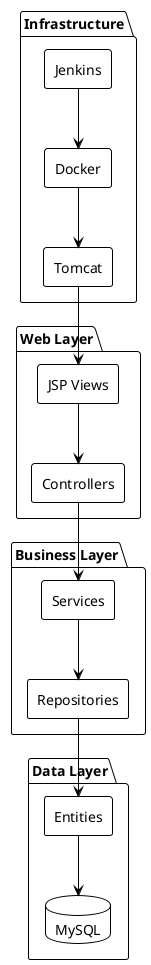

# Simple Banking System
## Project Technical Documentation

**Author**: SK-HARI-01  
**Date**: November 2, 2025  
**Repository**: Simple-Banking-System

### Executive Summary

The Simple Banking System is a web-based banking application built using Spring Boot and MySQL, providing essential banking operations for customers and administrators. The system supports user authentication, account management, transaction handling, and administrative oversight through a secure web interface. Built with modern Java technologies and deployable via Docker and Jenkins, the application demonstrates enterprise-ready features while maintaining simplicity and security.

### 1. Architecture Overview



### 2. Component Details

#### Core Components:
1. **Spring Boot Application**
   - Main class: `BankingSystemApplication.java`
   - WAR packaging for Tomcat deployment
   - Embedded Tomcat for development

2. **Entities**
   - `CustomerEntity`: Customer account information
   - `TransactionTable`: Banking transactions
   - `AdminEntity`: Administrator credentials

3. **Repositories**
   - `CustomerRepo`: Customer data access
   - `TransactionRepo`: Transaction management
   - `AdminRepo`: Admin authentication

4. **Controllers**
   - `LoginController`: Authentication
   - `AdminController`: Admin dashboard and operations
   - `CustomerController`: Customer operations

5. **Views (JSP)**
   - `LoginPage.jsp`: Authentication interface
   - `AdminDashboard.jsp`: Admin control panel
   - `CustomerHome.jsp`: Customer banking interface

### 3. Database Schema

```sql
-- Admin Table
CREATE TABLE IF NOT EXISTS admin (
    username VARCHAR(50) PRIMARY KEY,
    password VARCHAR(100) NOT NULL
);

-- Customer Table
CREATE TABLE IF NOT EXISTS customerentitytable (
    id BIGINT AUTO_INCREMENT PRIMARY KEY,
    uname VARCHAR(50) UNIQUE NOT NULL,
    password VARCHAR(100) NOT NULL,
    name VARCHAR(255) NOT NULL,
    phno VARCHAR(15),
    accno VARCHAR(20) UNIQUE NOT NULL,
    acctype VARCHAR(20),
    balance DECIMAL(15,2) DEFAULT 0.00,
    aadhaarno VARCHAR(12),
    panno VARCHAR(10)
);

-- Transaction Table
CREATE TABLE IF NOT EXISTS transactiontable (
    id BIGINT AUTO_INCREMENT PRIMARY KEY,
    transactionid VARCHAR(50) UNIQUE NOT NULL,
    detail VARCHAR(255),
    type VARCHAR(20),
    amount DECIMAL(15,2),
    date DATE,
    customer_id BIGINT,
    FOREIGN KEY (customer_id) REFERENCES customerentitytable(id)
);
```

### 4. Setup and Deployment

#### Local Development
```powershell
# Build the project
mvn clean package -DskipTests

# Run with embedded Tomcat
mvn spring-boot:run
```

#### Docker Deployment
```dockerfile
FROM tomcat:10-jdk17
COPY target/*.war /usr/local/tomcat/webapps/ROOT.war
ENV SPRING_PROFILES_ACTIVE=prod
EXPOSE 8080
```

```yaml
# docker-compose.yml
version: '3.8'
services:
  mysql:
    image: mysql:8.0
    environment:
      MYSQL_DATABASE: BankDB
      MYSQL_ROOT_PASSWORD: ${MYSQL_ROOT_PASSWORD}
    volumes:
      - mysql_data:/var/lib/mysql

  webapp:
    build: .
    ports:
      - "8080:8080"
    environment:
      SPRING_DATASOURCE_URL: jdbc:mysql://mysql:3306/BankDB
      SPRING_DATASOURCE_USERNAME: ${MYSQL_USER}
      SPRING_DATASOURCE_PASSWORD: ${MYSQL_PASSWORD}
    depends_on:
      - mysql

volumes:
  mysql_data:
```

### 5. Security Considerations

1. **Password Hashing Implementation**
```java
@Configuration
public class SecurityConfig {
    @Bean
    public PasswordEncoder passwordEncoder() {
        return new BCryptPasswordEncoder();
    }
}
```

2. **Environment Variables**
```properties
# application.properties
spring.datasource.url=${SPRING_DATASOURCE_URL}
spring.datasource.username=${SPRING_DATASOURCE_USERNAME}
spring.datasource.password=${SPRING_DATASOURCE_PASSWORD}
```

3. **Security Headers**
```java
@Configuration
public class WebSecurityConfig {
    @Bean
    public SecurityFilterChain filterChain(HttpSecurity http) throws Exception {
        http
            .headers()
            .xssProtection()
            .and()
            .contentSecurityPolicy("default-src 'self'");
        return http.build();
    }
}
```

### 6. Known Issues and Solutions

1. **JSP Property Resolution**
   - Issue: Property [accountNo] not found
   - Fix: Updated JSP to use correct entity property names (accno)

2. **Database Initialization**
   - Issue: Tables recreated on each startup
   - Fix: Set spring.sql.init.mode=never in application.properties

3. **Session Management**
   - Issue: Admin session not properly validated
   - Fix: Added robust session checking in AdminController

### 7. Future Enhancements

#### Short-term
- Implement BCrypt password hashing
- Add Spring Security integration
- Implement transaction pagination
- Add CSV export for admin reports

#### Long-term
- Microservice architecture migration
- Comprehensive audit logging
- OAuth2 authentication
- Automated deployment pipeline

### 8. Appendix

#### Key Files
```
├── pom.xml                 # Project dependencies
├── Dockerfile             # Container build
├── docker-compose.yml     # Container orchestration
├── Jenkinsfile           # CI/CD pipeline
├── src/
│   ├── main/
│   │   ├── java/         # Java source files
│   │   ├── resources/    # Configuration files
│   │   └── webapp/       # JSP views
│   └── test/
│       └── java/         # Test files
```

This report represents the current state of the Simple Banking System project. For the most up-to-date information, please refer to the source code repository.